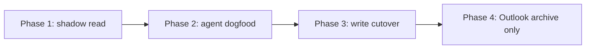

# Backend plan: O365 mailbox to ticketing system

**Paired document:** [Frontend plan — agent UI](o365-ticketing-migration-frontend.plan.md) (Next.js App Router, shadcn/ui, routes, auth UX, loading states). The REST API in §8 and milestones §11 are the **contract** for that UI. If you change endpoints, payloads, or milestone scope here, update the frontend plan in the same change.

> **Note:** This file was split from the former combined plan. Historical edits may still exist in `o365-ticketing-migration_338a5375.plan.md` only as a hub pointer — treat **this file** as the source of truth for backend.

# Ticketing migration plan: shared O365 mailbox to self-hosted system

## Blocker and default paths (milestone 2)

**Chosen default (2026-05): inbound via Power Automate (E1), outbound via Microsoft Graph only.** Rationale: Entra admin timeline is uncertain; you already have Power Automate Premium and prefer PA operations over owning Graph subscription renewal; PA does not replace outbound (explicit decision).

**What still needs credentials before customer cutover:**
- **Outbound:** Graph `Mail.Send` (application permission + admin consent, recommended narrow grant) **or** the same via **delegated** auth on a service mailbox (Fallback A — often no admin consent). PA is **not** used for sends.
- **Inbound (PA path):** the flow runs under a user/service connection with access to the shared mailbox; no tenant-wide app permission for `Mail.Read` is strictly required for the happy path if the PA payload is sufficient. If workers must call Graph for raw MIME or large attachments, add **delegated `Mail.Read`** (or application `Mail.Read` if admin grants it) — document which in milestone 2.

**Pre-milestone-0 (parallel with milestone 1):**
1. Identify who can grant admin consent for **`Mail.Send` only** (Global Administrator or Application Administrator, depending on tenant). Smaller ask than `Mail.ReadWrite`.
2. If admin consent is slow, stand up **Fallback A** (service account + delegated `Mail.Send` + optional `Mail.Read`) so outbound (and optional Graph fetches) work without waiting.
3. Build the **Power Automate** flow in a durable account (shared mailbox access, Premium licensed); export flow definition to git when stable.

### Inbound path options (preference order)

- **Primary — E1: Power Automate inbound.** Flow: `When a new email arrives (V3)` → `Get email (V2)` (include **Internet message headers** for `In-Reply-To` / `References`) → HTTP POST to `/api/webhooks/power-automate` (**HMAC-SHA256 required** — see §2.1 below for the verification recipe) → on HTTP 2xx, `Move email (V2)` to `Inbox/Ticketed`. Store `power_automate_run_id` in `email_events` for cross-debugging. **v1 default: no active Graph subscription** — renewal jobs disabled; `graph_subscriptions` DDL may exist with zero rows until optional Graph-inbound upgrade. IMAP reconciler remains the backstop for missed PA runs.
- **Alternative (upgrade later): Graph subscriptions on Inbox** — same threading and DB code paths, different trigger (`/api/webhooks/graph/notification` + `graph_subscriptions` + lifecycle). Switch when admin grants application `Mail.ReadWrite` and you want to delete PA from the critical path.
- **Fallback A — Delegated Graph (service mailbox).** Same as before: OAuth refresh token for unattended `Mail.Send` and optional `Mail.Read`. Use when application permissions are blocked but self-consent works.
- **Fallback B / C** — unchanged; last resorts.

### Outbound (fixed)

- **Power Automate for outbound — out of scope.** All sends: Graph from `outbound_queue` (see earlier section).

`[speculative]` In most tenants, delegated `Mail.ReadWrite` and `Mail.Send` do not require admin consent — but some tenants set "Users can consent to apps from verified publishers" or stricter policies that block self-consent. If Fallback A's user-consent step is also blocked, **outbound still requires admin consent for Graph `Mail.Send`** in every variant except temporary manual Outlook sends. Inbound without Graph read remains available via E1 (PA) or, with heavy tradeoffs, Fallback B.

### Decision rule (updated)

- **Default:** ship **E1 (PA inbound) + Graph outbound**; pursue **`Mail.Send` admin consent** or **delegated Fallback A** in parallel with milestone 1.
- **Upgrade to Graph inbound** only after admin grants `Mail.ReadWrite` *and* you want to remove PA from the architecture; not required for v1 success.
- Don't pick B or C unless E1 is also blocked.

---

Confirmed constraints:
- **Data residency: Sweden preferred, EU acceptable.** All persistent data (DB, attachment object store, backups, function execution region for inbound webhooks) must live in EU. Recommended target: Supabase + Vercel both in Stockholm (`eu-north-1` / `arn1`); fallback Frankfurt (`eu-central-1` / `fra1`) if a feature is unavailable in Stockholm. `[speculative]` Stockholm region availability for both providers is current as of mid-2026; verify at provisioning time and fall back to Frankfurt if not.
- **Outlook stays in use.** The shared mailbox is not retired. After we ingest a message into the ticket system we move the original from `Inbox` to `Inbox/Ticketed` — **by Power Automate on the default path** (after our webhook returns 2xx), or by Graph `move` + `mailbox_actions` on the Graph-subscription upgrade path. Outbound replies remain in `Sent Items` (Graph default) and are not moved — agents may still want to verify them in Outlook.
- **Internal hosting is the aspirational target.** v1 ships on Supabase + Vercel (EU). Section 14 documents the swap path so a future migration to on-prem (Postgres + Node + MinIO + Caddy) is a deployment-and-config change, not a redesign.

Confirmed parameters:
- **Volume:** <500 tickets/month, ~2500 emails/month total, peak 30/hour. Default architecture (pg_cron-driven workers) is sized for this. Re-evaluate worker design only if volume crosses ~2000 tickets/month.
- **Retention:** **7 years** from ticket close, matching Swedish bookkeeping defaults. Daily retention cron deletes tickets, messages, and attachments past the threshold.
- **GDPR right-to-erasure:** **anonymise on request** — replace requester email/name with a salted hash everywhere they appear (headers, body bodies, attachment metadata), retain ticket structure for audit. Attachments containing customer data are deleted from object storage as part of the procedure.
- **Backup tier:** **daily snapshots** (Supabase free/Pro). RPO = 24 hours; user accepts. Mitigation: a separate daily `pg_dump` to a different EU bucket, rotating 30 days (~negligible cost), giving us a second restore path.
- **Incident notification:** **Microsoft Teams** via incoming webhook (one channel for ops alerts).
- **Internal note visibility:** all agents see all tickets and all internal notes (no team partitioning).
- **Attachment cap:** **25 MB** per file. Defer Graph upload sessions to v2.
- **Auto-replies / DSNs:** **ingest as a ticket** and move to `Ticketed`; agent decides what to do. Never silently drop.
- **DNS / MX:** controlled by your org. Useful for future SPF/DKIM tweaks; not required by the recommended path.
- **Existing mailbox automations:** none known. (If anything surfaces during Phase 1 shadow read, document and disable.)
- **Power Automate:** **primary inbound path (E1)** — Premium already licensed; **never for outbound** — all sends via Microsoft Graph (see decisions log).

Other assumptions:
- Solo dev, English-only UI, single shared mailbox, no SLA contracts, no customer portal.

Speculation is labeled `[speculative]` inline.

---

## 1. Stack evaluation

E = effectiveness for this workload, E = effort to build, C = monthly cost, R = risk, T = time to first usable.

| Stack | Effectiveness | Effort | Cost (USD/mo) | Risk | Time to v1 |
|---|---|---|---|---|---|
| a. Supabase (Stockholm) + Next.js on Vercel (Stockholm/Frankfurt) | High — Postgres `text[]` for `References`, RLS for agents, pg_cron, Vercel Cron for workers (Graph subscription renewal optional if Graph inbound enabled); TS for MIME parsing; Supabase EU regions including Stockholm `[speculative]` | Medium — webhook + worker pattern is well-trodden, no ops | $0 free tier; $25 Supabase Pro + $20 Vercel Pro at modest scale | Low — both providers stable, data is portable Postgres, EU residency native | 5-7 weeks |
| b. Vercel + Neon Postgres (EU) | High — same Postgres benefits, Neon branching is nice for migrations, Neon has EU regions | Medium-High — must roll own auth (Clerk/NextAuth) and cron orchestration; no RLS-as-product; need separate object store with EU residency | $20 Vercel + $0-$19 Neon + storage | Low-Medium — more glue code = more places for solo dev to mis-wire auth | 6-8 weeks |
| c. PHP + MySQL on a VPS (Hetzner/Glesys/Binero in Sweden) | Medium — MySQL JSON arrays are workable but inferior to Postgres `text[]` + GIN for `References` matching; PHP MIME libs are usable but Graph SDK story is weaker than TS | Medium — but ops burden (patching, backups, TLS, monitoring, deliverability if running SMTP) is yours forever | $5-15 VPS + $5 backups | High — single dev = single point of ops failure; a missed kernel/MySQL CVE is on you; restore drills get skipped. Plus side: data physically in Sweden by default | 5-6 weeks of code, infinite ops |

### Recommendation: (a) Supabase (Stockholm) + Next.js on Vercel (Stockholm or Frankfurt).

Provision both projects explicitly in EU regions:
- Supabase project region: `eu-north-1` (Stockholm) preferred, `eu-central-1` (Frankfurt) fallback. This pins Postgres, Storage, Edge Functions, and backups to that region. `[speculative]` Confirm pg_cron and PITR are available in the chosen region at provisioning time.
- Vercel: set Function Region to `arn1` (Stockholm) or `fra1` (Frankfurt) in `vercel.json`; this controls where webhook handlers and the cron runner execute. Static assets go to the global edge — that's fine because they contain no PII.
- Supabase Storage bucket for attachments: same region as the DB.

Specifically against the alternatives:
- **vs (b) Vercel + Neon**: Supabase ships Auth, RLS, Storage (for attachments) all in one EU project. With (b) you write auth glue (Clerk has EU residency on enterprise plans only — extra cost; NextAuth costs time), pick a separate object store, and schedule cron via Vercel Cron only. For a solo dev optimizing for correctness over novelty, fewer moving parts wins.
- **vs (c) PHP + MySQL + VPS in Sweden**: The user's preference puts data in Sweden by default and removes vendor lock-in, which is genuinely valuable. But it is the worst fit for *this specific workload*: threading needs efficient containment lookup against `References` (an array of Message-IDs); Postgres `text[] && text[]` with GIN is the right primitive and MySQL has no native equivalent. MIME parsing in TypeScript is more robust than the PHP equivalents. The ops burden is permanent and uncompensated. The right path: build on (a) now, plan for an internal-hosting migration later (see §14) which keeps the Postgres schema, code, and worker pattern unchanged.

The one real loss with (a) is that Vercel functions are ephemeral; long-running tasks (e.g., Graph large attachment upload sessions for 100MB files) need chunking. v1 caps attachments at 25MB so this is moot.

---

## 2. Email transport

| Option | Effectiveness | Effort | Cost (USD/mo) | Risk | Time |
|---|---|---|---|---|---|
| a. Graph subscriptions (webhooks) | High — full headers via raw MIME or extended properties; near real-time | Medium — Azure app reg, sub renewal job, lifecycle handler | $0 (in existing M365 license) | Medium — subs expire every ~70.5h, missed events possible during outage; mitigated by IMAP backstop | 1 week |
| b. IMAP polling | Medium — full headers; ~30-60s latency | Medium — must implement OAuth2 (XOAUTH2); Microsoft is throttling/deprecating IMAP basic auth | $0 | High — Microsoft is increasingly hostile to IMAP/SMTP AUTH on M365; IDLE on serverless is awkward | 1 week |
| c. Third-party inbound parser (Postmark/SendGrid) + O365 forwarding | High — clean parsed payload, signed webhooks | Low | $10-20 (Postmark) | Medium — adds a third party; DKIM realignment if outbound also goes through them | 3 days |
| d. Direct MX takeover | High — full control | High — own SMTP receive infra or relay; cutover is irreversible without DNS revert + TTL pain | $5-50 | High — no parallel run; loss of mail during propagation; no fast rollback | 2-3 weeks |

### Recommendation (v1 default vs optional upgrade)

**Default (chosen):**
- **Inbound:** **Power Automate (E1)** — `When a new email arrives` → `Get email (V2)` with **Internet message headers** → signed HTTP POST to `/api/webhooks/power-automate` → on **2xx**, PA **moves** the item to `Inbox/Ticketed`. **IMAP polling** remains the reconciliation backstop (missed PA runs, connector outages).
- **Outbound:** **Microsoft Graph only** (`sendMail` / `createReply`, two-phase `outbound_queue`, `x-outbound-id`, Sent Items reconciler). **Never PA for outbound.**

**Optional upgrade (later):** replace PA inbound with **Graph subscriptions on the Inbox folder** when admin grants application **`Mail.ReadWrite`** and you want one less moving part in M365. Same DB threading and idempotency; swap trigger implementation only; re-enable `graph_subscriptions` + renewal jobs.

**Why not Graph as default for you:** Entra admin timeline is uncertain; PA avoids Graph subscription lifecycle (`~70.5h` renewal, lifecycle webhooks, `clientState` validation) while you still ship; you already run Premium and prefer PA ops.

**Trade accepted with PA default:** inbound debugging spans PA run history + our `email_events` (store `power_automate_run_id`); PA/connector incidents delay ticket creation until IMAP reconciles (bounded latency).

#### Symmetry and threading (unchanged goals)

- Customer replies to our Graph-sent mail land in the same mailbox; with **PA default**, the **next** `When a new email arrives` fires for that reply — no Graph subscription required for that leg.
- Threading still uses `In-Reply-To` / `References` from PA headers (or raw MIME if Graph fetch added later).
- For *cold* outbound, `sendMail` with `x-ticket-id` / subject token as before.

#### Post-ingest folder move — two shapes

**Shape A — PA default (happy path):** our webhook returns **2xx only after** the DB transaction commits; PA's next step moves the message to `Inbox/Ticketed`. If PA move fails after commit, enqueue `mailbox_actions` for Graph `move` (requires `Mail.ReadWrite` or delegated read+write — document which credential backs this repair path in milestone 2).

**Shape B — Graph inbound upgrade:** same as the original plan: after DB commit, enqueue `mailbox_actions`; worker calls Graph `move`.

Why the webhook must return 2xx only after commit: if PA moves first on 2xx and our DB insert fails, mail sits in `Ticketed` without a ticket — `inbox.reconcile` + IMAP still recover, but it is noisier. Prefer: PA calls webhook → we commit → 2xx → PA moves.

Subscription scoping (Graph upgrade only): subscribe to Inbox folder so moved mail does not re-notify.

What about non-ticketable mail in the Inbox (spam, autoresponders, broken DSNs)? v1 still ingests and creates a ticket (perhaps marked `bounced`), then moves it. The agent decides what to do with the ticket. We do **not** auto-classify and skip in v1 — that's an opportunity to lose mail.

`[speculative]` Graph's `internetMessageHeaders` collection officially restricts custom headers to the `x-` prefix; setting `In-Reply-To`/`References` directly is rejected. The createReply route bypasses this because Graph computes them server-side from the parent message.

`[speculative]` Microsoft renamed Entra ID from Azure AD; both terms are used in docs. App registration UX is the same.

### 2.1 PA webhook security — HMAC-SHA256 (mandatory)

**Decision: HMAC-SHA256 is required. A static bearer token alone is not accepted for v1.** Rationale: a static secret passed as a plain header appears in PA run history, Vercel request logs, and any logging middleware that captures headers — a single log exfiltration exposes the secret forever. HMAC signs the *body* with a key that never travels in the clear.

#### How it works

Power Automate side (in the HTTP action's **Headers**):

```
x-pa-hmac-sha256: @{base64(hmacSha256(body('Get_email_(V2)'), base64ToBinary(variables('WebhookSecret'))))}
```

- `WebhookSecret` is a flow variable populated from a PA Environment Variable (type: Secret). Rotate it by updating the PA variable and the Vercel env in the same deploy — the old secret is gone the moment both sides are updated.
- Use PA's `hmacSha256(message, key)` expression; the key must be passed as binary (hence `base64ToBinary`).

Next.js webhook handler (`/api/webhooks/power-automate`):

```typescript
import { createHmac, timingSafeEqual } from 'node:crypto';

export async function POST(req: Request) {
  const rawBody  = await req.arrayBuffer();
  const received = req.headers.get('x-pa-hmac-sha256') ?? '';
  const secret   = process.env.PA_WEBHOOK_SECRET!;          // base64-encoded key

  const expected = createHmac('sha256', Buffer.from(secret, 'base64'))
    .update(Buffer.from(rawBody))
    .digest('base64');

  const match = timingSafeEqual(
    Buffer.from(received, 'base64'),
    Buffer.from(expected,  'base64'),
  );

  if (!match) {
    // Log to email_events before returning so we can alert on repeated failures.
    await db.insert(emailEvents).values({
      source: 'power_automate_webhook', event_type: 'auth.fail',
      payload: { ip: req.headers.get('x-forwarded-for') },
    });
    return new Response('Forbidden', { status: 401 });
  }

  // ... dedup + inbound.process enqueue
}
```

Key points:
- **`timingSafeEqual`** prevents timing-oracle attacks; always compare HMAC outputs this way.
- The raw body must be captured *before* any JSON parsing — once parsed, the byte-for-byte representation may differ.
- A 401 on HMAC mismatch is logged to `email_events(event_type='auth.fail')`. If the rate of failures exceeds a threshold (e.g. 3 in 5 minutes), `notify.teams` fires (see §9 failure modes).
- Secret rotation: generate a new 32-byte random key (`openssl rand -base64 32`), update PA Environment Variable first, then update Vercel env and redeploy. The window where old-PA-secret meets new-server-key is bounded by the PA flow execution time (<1 min); the IMAP reconciler covers any messages that arrive during the gap.

#### Why not a static bearer in addition?

Defense-in-depth with two *independent* secrets (HMAC + bearer) would be fine, but it adds operational overhead for secret rotation with marginal benefit once HMAC is in place. v1 ships HMAC only; if a network-layer defense is wanted, restrict the Vercel function's allowed IP range to Microsoft's PA egress CIDRs instead (a single `vercel.json` `allowList` entry, no code change).

---

## 3. Migration and cutover

Run in four phases, each independently abortable.



- **Phase 1 (1 week, shadow read)**: **Power Automate flow live** on Inbox — HTTP POST to webhook only (**omit the PA move step** or guard it behind `false`); tickets created; agents continue replying in Outlook against the untouched Inbox. Confirm threading, idempotency, latency on real traffic. Compare ticket count vs mailbox unread count daily.
- **Phase 2 (1 week, dogfood)**: agents view in UI, take notes in UI, but reply from Outlook. **Folder-move still disabled.** Catch UX issues with no risk to customer comms.
- **Phase 3 (cutover day)**: agents reply from UI exclusively. **Enable the PA move step** (or enable `mailbox_actions` moves on Graph upgrade path). Inbox now self-empties as the system processes mail. Outlook stays open as a verification surface — agents can see in real time that the system is keeping up (Inbox should hover near zero).
- **Phase 4**: communicate the new norm: "if it's in Inbox, ticketing has not picked it up yet — let the dev know"; mailbox now functions as the email transport endpoint plus a live health dashboard.

Historical import: backfill last **90 days** via Graph `/users/{shared}/messages?$filter=receivedDateTime ge X`, group by header chains (not Graph `conversationId` alone — it disagrees with strict header threading on forwarded mail [speculative]), insert with `direction='inbound'` and `received_at` from the original. Older mail stays searchable in Outlook only. Configurable; if user needs more, run the same job with a wider window.

In-flight threads at cutover: customer replies to a pre-cutover Outlook message → **PA trigger fires** (or Graph notification if upgraded) → threading algorithm tries headers (no match in our DB), tries subject token (none), tries subject normalization within 14d window — if requester+normalized-subject match a backfilled ticket, attach; otherwise create new ticket. Acceptable.

Rollback (week 1 disaster):
1. Tell agents to use Outlook again.
2. **Turn off the Power Automate flow** (and if Graph inbound upgrade is enabled, disable the Graph subscription too).
3. No mail is lost — it's all in the mailbox.
4. Tickets DB stays for postmortem.

---

## 4. Architecture

All persistent components in EU region (Stockholm preferred).

```
                    +-------------------------------+
 Customer email --> | O365 shared mailbox           |
                    |   /Inbox   -> new mail        |
                    |   /Ticketed -> after ingest   |
                    |   /Sent Items -> our outbound |
                    +---+-----------+---------------+
                        |
            (1) Power Automate (default): new mail
                -> Get email (headers+body)
                -> POST /api/webhooks/power-automate
                -> on 2xx: Move to Inbox/Ticketed
                        |
            (1b) [optional later] Graph Inbox subscription
                -> /api/webhooks/graph (same DB pipeline)
                        |
                        v
                  +---------------------------------+
                  | Next.js on Vercel (arn1/fra1)   |
                  |  webhooks: power-automate (+    |
                  |   graph if upgrade enabled)     |
                  |  dedupe -> insert email_events  |
                  |  -> enqueue inbound.process job  |
                  +-----------------+---------------+
                                    |
              (2) Optional Graph GET for raw MIME /
                  attachments (delegated or app perms)
                                    v
                  +---------------------------------+
                  | Supabase Postgres (eu-north-1)  |
                  |  jobs, messages, tickets,       |
                  |  outbound_q, email_events,      |
                  |  mailbox_actions (repair path), |
                  |  mailbox_cfg, graph_subscriptions|
                  |  (subscriptions row empty until |
                  |   Graph inbound upgrade)         |
                  +--+---------------------+--------+
                     |                     |
            pg_cron jobs            RLS-protected reads
                     |                     |
                     v                     v
        +-----------------------+  +------------------+
        | Workers (Vercel fns): |  | Next.js UI       |
        |  inbound.process      |  | <10 agents       |
        |  outbound.send        |  | Microsoft SSO    |
        |  mailbox.actions      |  +------------------+
        |  graph.sub.renew [*]  |
        |  imap.reconcile         |
        |  inbox.reconcile        |
        +---------+---------------+
                  |  [*] only if Graph inbound enabled
                  |
            (3) Graph sendMail / createReply (outbound only)
                  v
        +-------------------------+
        | O365 sends to customer  |
        | -> appears in Sent Items|
        +-------------------------+
                                  +---------------------+
        Attachments (binary) <---| Supabase Storage    |
                                  | (eu-north-1 bucket) |
                                  +---------------------+
```

External deps: Microsoft 365 (Exchange Online), Power Automate, Microsoft Graph (for outbound always; for inbound fetch only if enabled), Supabase EU, Vercel EU, Supabase Storage EU.

---

## 5. Data model (Postgres DDL)

```sql
create extension if not exists citext;

create table agents (
  id             bigserial primary key,
  email          citext unique not null,
  name           text not null,
  role           text not null default 'agent' check (role in ('agent','admin')),
  is_active      boolean not null default true,
  signature_html text,                              -- per-agent HTML signature appended on outbound send
  created_at     timestamptz not null default now()
);

create table tickets (
  id                    bigserial primary key,
  number                text unique not null,           -- 'TKT-1234' subject token
  subject_normalized    text not null,
  status                text not null default 'open'
                          check (status in ('open','pending','resolved','closed')),
  assignee_id           bigint references agents(id),
  requester_email       citext not null,                -- becomes 'anon-<hash>@anonymised.local' after erasure
  requester_email_hash  text,                           -- sha256(lower(email) || pepper); set on anonymise
  anonymised_at         timestamptz,
  created_at            timestamptz not null default now(),
  updated_at            timestamptz not null default now(),
  closed_at             timestamptz,                    -- retention cron uses this + 7 years
  ts_subject            tsvector                        -- maintained by trigger below; index below
);
create index tickets_inbox     on tickets (status, assignee_id);
create index tickets_requester on tickets (requester_email);
create index tickets_subject_recent on tickets (subject_normalized, created_at desc)
  where status <> 'closed';
create index tickets_fts on tickets using gin (ts_subject);

create table messages (
  id              bigserial primary key,
  ticket_id       bigint not null references tickets(id) on delete cascade,
  direction       text not null check (direction in ('inbound','outbound','internal_note')),
  message_id      text,
  in_reply_to     text,
  references_ids  text[] not null default '{}',
  graph_message_id text,
  from_email      citext,
  to_emails       citext[],
  cc_emails       citext[],
  subject         text,
  body_text       text,
  body_html       text,
  raw_mime_key    text,
  received_at     timestamptz,
  sent_at         timestamptz,
  agent_id        bigint references agents(id),
  anonymised_at   timestamptz,
  created_at      timestamptz not null default now(),
  ts_body         tsvector                              -- maintained by trigger below; index below
);
create unique index messages_message_id_uniq on messages (message_id)
  where message_id is not null;
create index messages_ticket          on messages (ticket_id, created_at);
create index messages_in_reply_to     on messages (in_reply_to) where in_reply_to is not null;
create index messages_references_gin  on messages using gin (references_ids);
create index messages_fts             on messages using gin (ts_body);

create table attachments (
  id           bigserial primary key,
  message_id   bigint not null references messages(id) on delete cascade,
  filename     text not null,
  content_type text,
  size_bytes   bigint not null,
  storage_key  text not null,
  sha256       bytea not null,
  content_id   text,
  created_at   timestamptz not null default now()
);
create index attachments_message on attachments (message_id);
create unique index attachments_dedup on attachments (message_id, sha256);

create table email_events (
  id           bigserial primary key,
  source       text not null check (source in
                  ('power_automate_webhook','graph_webhook','graph_lifecycle','imap_reconcile',
                   'outbound_send','outbound_reconcile','manual')),
  event_type   text not null,
  external_id  text,
  payload      jsonb not null,
  message_id   bigint references messages(id),
  ticket_id    bigint references tickets(id),
  created_at   timestamptz not null default now()
);
create index email_events_recent on email_events (created_at desc);
create unique index email_events_dedupe on email_events (source, external_id)
  where external_id is not null;

create table outbound_queue (
  id                      bigserial primary key,
  ticket_id               bigint not null references tickets(id),
  in_reply_to_message_id  bigint references messages(id),
  agent_id                bigint not null references agents(id),
  body_text               text,
  body_html               text,
  to_emails               citext[] not null,
  cc_emails               citext[],
  status                  text not null default 'pending'
                            check (status in ('pending','sending','sent','failed','dead')),
  attempts                int not null default 0,
  last_error              text,
  next_attempt_at         timestamptz not null default now(),
  graph_draft_id          text,
  sent_message_id         text,
  idempotency_key         uuid not null default gen_random_uuid(),
  created_at              timestamptz not null default now(),
  sent_at                 timestamptz
);
create index outbound_ready on outbound_queue (next_attempt_at)
  where status in ('pending','failed');
create index outbound_sending on outbound_queue (status, created_at)
  where status = 'sending';

create table graph_subscriptions (
  id              bigserial primary key,
  subscription_id text unique not null,
  resource        text not null,
  expires_at      timestamptz not null,
  client_state    text not null,
  created_at      timestamptz not null default now()
);
create index graph_subs_expiring on graph_subscriptions (expires_at);

create table mailbox_config (
  id                       int primary key default 1 check (id = 1),
  mailbox_user_id          text not null,
  mailbox_address          citext not null,
  inbox_folder_id          text not null,
  ticketed_folder_id       text not null,
  ticketed_folder_name     text not null default 'Ticketed',
  updated_at               timestamptz not null default now()
);

create table mailbox_actions (
  id                bigserial primary key,
  message_id        bigint references messages(id) on delete set null,
  graph_message_id  text not null,
  action            text not null check (action in ('move_to_processed','categorize','delete')),
  target_folder_id  text,
  status            text not null default 'pending'
                       check (status in ('pending','running','completed','failed','dead')),
  attempts          int not null default 0,
  last_error        text,
  next_attempt_at   timestamptz not null default now(),
  created_at        timestamptz not null default now(),
  completed_at      timestamptz
);
create unique index mailbox_actions_open_uniq
  on mailbox_actions (graph_message_id, action)
  where status in ('pending','running','failed');
create index mailbox_actions_ready
  on mailbox_actions (next_attempt_at)
  where status in ('pending','failed');

create table snippets (
  id          bigserial primary key,
  title       text not null,
  content     text not null,                      -- HTML; sanitised at compose time before inclusion
  created_by  bigint references agents(id),
  is_global   boolean not null default true,      -- true: shared with all agents; false: personal to created_by
  created_at  timestamptz not null default now(),
  updated_at  timestamptz not null default now()
);
create index snippets_global  on snippets (is_global, title) where is_global;
create index snippets_personal on snippets (created_by, title) where not is_global;

create table audit_logs (
  id          bigserial primary key,
  ticket_id   bigint not null references tickets(id) on delete cascade,
  agent_id    bigint references agents(id),       -- null for system-generated entries
  action      text not null,                      -- 'status_change', 'assigned', 'snippet_used',
                                                  -- 'reply_sent', 'note_added', 'merged', 'anonymised', etc.
  metadata    jsonb not null default '{}'::jsonb, -- e.g. {"from":"open","to":"pending"} or {"snippet_id":42}
  created_at  timestamptz not null default now()
);
create index audit_logs_ticket on audit_logs (ticket_id, created_at desc);
create index audit_logs_action on audit_logs (action, created_at desc);

-- Per-agent read tracking.  A row means "agent last viewed ticket at last_read_at".
-- No row = never viewed = unread.  Upserted (INSERT ... ON CONFLICT DO UPDATE)
-- when an agent opens the ticket detail view.
create table ticket_reads (
  agent_id     bigint not null references agents(id)  on delete cascade,
  ticket_id    bigint not null references tickets(id)  on delete cascade,
  last_read_at timestamptz not null default now(),
  primary key  (agent_id, ticket_id)
);
create index ticket_reads_agent on ticket_reads (agent_id, last_read_at desc);

-- Full-text search triggers (English dictionary; swap language per locale if needed).
-- Stored tsvectors avoid re-computing weights on every query; trade: INSERT/UPDATE is slightly
-- slower, which is fine given <500 tickets/month volume.

create or replace function tickets_ts_trigger_fn() returns trigger language plpgsql as $$
begin
  new.ts_subject := to_tsvector('english',
    coalesce(new.subject_normalized,'') || ' ' ||
    coalesce(new.number,''));
  return new;
end $$;

create trigger tickets_ts_update
  before insert or update of subject_normalized, number
  on tickets for each row execute function tickets_ts_trigger_fn();

create or replace function messages_ts_trigger_fn() returns trigger language plpgsql as $$
begin
  new.ts_body := to_tsvector('english',
    coalesce(new.subject,'')    || ' ' ||
    coalesce(new.body_text,'') || ' ' ||
    -- Strip HTML tags from body_html before indexing so angle-bracket noise is excluded.
    regexp_replace(coalesce(new.body_html,''), '<[^>]+>', ' ', 'g'));
  return new;
end $$;

create trigger messages_ts_update
  before insert or update of subject, body_text, body_html
  on messages for each row execute function messages_ts_trigger_fn();
```

**Full-text search (FTS) note for §8:** `GET /api/tickets?q=billing+invoice` translates `q` through `websearch_to_tsquery('english', $q)` and matches against `tickets.ts_subject` **or** the latest unread message in `messages.ts_body` for that ticket. Because `websearch_to_tsquery` accepts natural-language operators (`OR`, `-`, `"phrase"`) without SQL injection risk, it is the preferred translation function over `plainto_tsquery`. The query used in the handler:

```sql
SELECT DISTINCT t.*
FROM   tickets t
LEFT   JOIN messages m ON m.ticket_id = t.id
WHERE  (t.ts_subject @@ websearch_to_tsquery('english', $q)
     OR m.ts_body    @@ websearch_to_tsquery('english', $q))
  AND  <rls_active_agent_condition>
ORDER  BY t.updated_at DESC
LIMIT  25;
```

Backfill for existing rows (run once after the migration that adds the triggers):

```sql
UPDATE tickets  SET ts_subject = to_tsvector('english', coalesce(subject_normalized,'') || ' ' || coalesce(number,''));
UPDATE messages SET ts_body    = to_tsvector('english', coalesce(subject,'') || ' ' || coalesce(body_text,'') || ' ' || regexp_replace(coalesce(body_html,''),'<[^>]+>',' ','g'));
```

Index justification (only the non-obvious ones):
- `messages_message_id_uniq` partial: foundation of inbound idempotency; partial because internal notes have no Message-ID.
- `messages_references_gin`: needed for `WHERE references_ids && $1` containment lookup in threading step 1.
- `tickets_subject_recent` partial: subject-fallback threading only ever looks at non-closed tickets; partial keeps it small and hot.
- `email_events_dedupe` partial unique: webhook replay protection at the DB layer, not the app.
- `attachments_dedup`: avoids storing the same signature image hundreds of times.
- `mailbox_actions_open_uniq` partial: the worker can re-enqueue a move on retry without creating duplicate rows; only one open action per `(graph_message_id, action)` exists at any time. Completed rows accumulate as an audit trail.
- `snippets_global` / `snippets_personal` partial indexes: composer's snippet picker filters by `is_global = true OR created_by = me`; partial indexes keep each scan small and avoid an extra `WHERE` predicate cost.
- `audit_logs_ticket`: per-ticket audit panel reads ordered by recency; this is the hot path for `GET /api/tickets/:id/audit`.
- `ticket_reads_agent`: the unread-count badge in the nav sidebar queries `SELECT ticket_id FROM ticket_reads WHERE agent_id = me` and joins against recent `messages.created_at`; the index keeps this scan fast. The primary key already covers the detail-view upsert.
- `tickets_fts` / `messages_fts` GIN: Postgres GIN indexes over `tsvector` columns are the correct primitive for full-text search at this volume; they support `@@` with `websearch_to_tsquery` at sub-millisecond latency for tables of this size. Maintained by triggers, so query cost is zero beyond the GIN lookup.

Note on Graph IDs: when fetching messages we always send `Prefer: IdType="ImmutableId"`. Regular Graph IDs change when a message is moved (e.g., Inbox → Ticketed), which would break our move action between commit and execution. Immutable IDs are stable across folder moves.

### GDPR procedures

**Anonymise on request (Art. 17):** keep the ticket structure for audit, scrub the personal data.

```sql
-- Pepper lives in env, exposed via app.anon_pepper GUC at session start.
-- Anonymisation is idempotent: re-running on the same email is a no-op for already-scrubbed rows.
create or replace function anonymise_requester(p_email citext) returns int as $$
declare
  v_hash text := encode(
    sha256((lower(p_email) || current_setting('app.anon_pepper'))::bytea),
    'hex');
  v_anon citext := ('anon-' || left(v_hash, 12) || '@anonymised.local')::citext;
  v_count int := 0;
begin
  -- Tickets
  update tickets
     set requester_email      = v_anon,
         requester_email_hash = v_hash,
         anonymised_at        = coalesce(anonymised_at, now())
   where requester_email = p_email
     and anonymised_at is null;
  get diagnostics v_count = row_count;

  -- Messages: scrub headers + best-effort body redaction
  update messages m
     set from_email     = case when m.from_email = p_email then v_anon else m.from_email end,
         to_emails      = (select array_agg(case when e = p_email then v_anon else e end)
                             from unnest(m.to_emails) as e),
         cc_emails      = (select array_agg(case when e = p_email then v_anon else e end)
                             from unnest(m.cc_emails) as e),
         body_text      = regexp_replace(m.body_text, p_email::text, v_anon::text, 'gi'),
         body_html      = regexp_replace(m.body_html, p_email::text, v_anon::text, 'gi'),
         anonymised_at  = coalesce(m.anonymised_at, now())
   where m.ticket_id in (select id from tickets where requester_email_hash = v_hash);

  -- Attachments on those tickets: queue for deletion (objects removed by housekeeping job)
  insert into mailbox_actions (graph_message_id, action, status)
  select 'n/a', 'delete', 'pending'  -- placeholder; real impl: separate attachments_purge_queue
  where false;  -- (see below; using a dedicated table is cleaner)

  return v_count;
end;
$$ language plpgsql;
```

Limitations explicitly accepted in v1:
- Body redaction is regex-based; it catches verbatim email occurrences but not obfuscated forms ("john dot doe at example dot se"). Documented in the privacy policy.
- Attachment files require deletion from object storage; tracked via a small `attachments_purge` queue (DDL omitted; same pattern as `mailbox_actions`).
- The original mail still exists in O365 (Ticketed folder) — the customer's right-to-erasure request must also be carried out on the mailbox side. The admin UI surfaces this as a manual checklist item: "delete the corresponding messages from the shared mailbox".

**Retention (7 years):** daily cron deletes closed tickets past the threshold; cascade handles messages and attachments rows; a follow-up step removes attachment objects from Storage.

```sql
-- Run daily, transactional, batched.
-- Touches only closed tickets to avoid surprising open conversations.
delete from tickets
 where id in (
   select id from tickets
    where status = 'closed'
      and closed_at < now() - interval '7 years'
    order by closed_at
    limit 500
 );
-- Then: orphan-sweep object storage by listing keys not referenced in attachments.
```

`closed_at` is the trigger, not `created_at` — long-running tickets aren't penalised. Open tickets older than 7 years are surfaced in the admin UI as "stale tickets" for human review rather than auto-deleted.

---

## 6. Threading algorithm

```text
function resolveThread(parsed):
  refs = unique(nonempty(parsed.headers.References ++ [parsed.headers.InReplyTo]))

  # Step 1 - header chain
  if refs not empty:
    rows = SELECT ticket_id, max(created_at) as last_seen
             FROM messages
            WHERE message_id   = ANY(refs)
               OR references_ids && refs
         GROUP BY ticket_id
         ORDER BY last_seen DESC
    if len(rows) == 1:
      return EXISTING(rows[0].ticket_id)
    if len(rows) > 1:
      log_event('threading.collision.header_multi', payload={refs, candidates: rows})
      return EXISTING(rows[0].ticket_id)   # most recent wins; flag in UI

  # Step 2 - subject token (we control its format)
  m = regex(parsed.subject, r'\[TKT-(\d+)\]')
  if m:
    t = SELECT * FROM tickets WHERE number = 'TKT-' || m.group(1)
    if t:
      if refs not empty:
        log_event('threading.token_only_match', risk='low')   # client stripped headers
      return EXISTING(t.id)
    else:
      log_event('threading.token_unknown', risk='medium')     # forged or stale token
      # fall through; do NOT trust an unknown token to create a "bound" ticket

  # Step 3 - subject normalization, same requester, recent, not closed
  norm = normalize(parsed.subject)   # strip Re:/Fwd:/Fw:/AW:/SV:, collapse ws, lower
  if norm != '':
    cand = SELECT * FROM tickets
            WHERE subject_normalized = norm
              AND requester_email    = lower(parsed.from)
              AND created_at         > now() - interval '14 days'
              AND status             <> 'closed'
            ORDER BY created_at DESC LIMIT 1
    if cand:
      log_event('threading.subject_match', risk='medium')
      return EXISTING(cand.id)

  # Step 4
  return NEW()
```

Conflict policy: header > token > subject. Within step 1, multiple matches → most recent wins, flagged in UI for human merge. Subject match requires same `requester_email` to prevent cross-customer collision (e.g., generic subjects like "Question").

---

## 7. Idempotency and race conditions

The contract is enforced in the DB, not the app.

**Same email twice:**
```sql
INSERT INTO messages (ticket_id, direction, message_id, ...)
VALUES (...)
ON CONFLICT (message_id) WHERE message_id IS NOT NULL DO NOTHING
RETURNING id;
```
Zero rows returned ⇒ duplicate ⇒ ack webhook 200, do nothing else. Webhook handler also pre-inserts `email_events(source='power_automate_webhook'|'graph_webhook', external_id=delivery_or_run_id)` with its own unique constraint as a first-line dedupe before any work.

**Two agents replying simultaneously:** both insert into `outbound_queue`; both get unique `idempotency_key`s; both send; both persist. Order in the ticket is by `created_at`. We do not serialize replies — explicit choice; <10 agents, conflicts are rare and acceptable. Status changes (open→resolved) use `UPDATE tickets SET status=$1, updated_at=now() WHERE id=$2 AND updated_at=$3` (optimistic lock on `updated_at`); on lost update, UI re-fetches.

**Webhook retry storms:**
1. `INSERT INTO email_events (source, external_id, payload) VALUES (...)` — unique on `(source, external_id)`.
2. If `RETURNING id` is empty (already-seen), respond 200 immediately.
3. Otherwise enqueue a fetch job. Worker picks with `SELECT ... FOR UPDATE SKIP LOCKED LIMIT 5` to bound concurrency.

**Outbound double-send (the hardest one):** two-phase send.

```text
worker_tick():
  rows = SELECT * FROM outbound_queue
          WHERE status IN ('pending','failed')
            AND next_attempt_at <= now()
       ORDER BY next_attempt_at
            FOR UPDATE SKIP LOCKED
          LIMIT 5

  for row in rows:
    UPDATE outbound_queue
       SET status='sending', attempts=attempts+1
     WHERE id=row.id;  COMMIT;

    try:
      # Fetch sending agent + their signature, then append to body_html
      # (text fallback gets a plain-text rendering of the signature).
      sig_html = SELECT signature_html FROM agents WHERE id = row.agent_id
      body_html_final = (row.body_html or '') + (sig_html or '')
      body_text_final = row.body_text + ('\n\n' + html_to_text(sig_html) if sig_html else '')

      # createReply (or sendMail for cold) with header x-outbound-id = row.idempotency_key
      result = graph_send(row, body_html=body_html_final, body_text=body_text_final)
      UPDATE outbound_queue
         SET status='sent', sent_at=now(),
             sent_message_id=result.internetMessageId,
             graph_draft_id=result.id
       WHERE id=row.id;  COMMIT;
    except Throttled or Transient:
      UPDATE outbound_queue
         SET status='failed', last_error=err,
             next_attempt_at = now() + backoff(attempts)
       WHERE id=row.id;  COMMIT;
    except Permanent:
      UPDATE outbound_queue SET status='dead', last_error=err WHERE id=row.id;
      alert_admin(row)

reconcile_sending():
  # Crashed between Graph send and our COMMIT?
  for row in WHERE status='sending' AND attempts > 0 AND created_at < now() - '5 min':
    hits = graph_search_sent_items(header='x-outbound-id', value=row.idempotency_key)
    if hits:
      UPDATE outbound_queue SET status='sent', sent_message_id=hits[0].id WHERE id=row.id
    else:
      UPDATE outbound_queue SET status='failed', next_attempt_at=now() WHERE id=row.id
```

The `x-outbound-id` header (set on the draft before send) is the cross-system idempotency token; the reconciler queries Graph's Sent Items by header to determine whether a crashed attempt actually delivered. This is the only correct way; trying to dedupe purely in our DB lets a crashed worker double-send.

**Signature injection (worker-side, not composer-side):** the `outbound.send` worker reads `agents.signature_html` for `outbound_queue.agent_id` and appends it to `body_html` (and a `html_to_text` rendering to `body_text`) immediately before passing the body to Graph. We **do not** persist the signature inline on `outbound_queue` rows because (a) signatures change over time and we want the version that was current at send time, not at compose time; (b) it keeps the queue rows small; (c) it keeps the composer UX free of a "signature already attached" preview that has to stay in sync. The reply that lands back in `messages` (after Graph send + reconciler) carries the full signed body — that is the source of truth for what the customer received. Internal notes (`direction='internal_note'`) bypass the worker entirely and never get a signature appended.

**Mailbox move idempotency:** moving an already-moved message is naturally safe — the worker's logic is:

```text
mailbox_action_tick():
  rows = SELECT * FROM mailbox_actions
          WHERE status IN ('pending','failed')
            AND next_attempt_at <= now()
       ORDER BY next_attempt_at
            FOR UPDATE SKIP LOCKED LIMIT 10

  for row in rows:
    UPDATE mailbox_actions SET status='running', attempts=attempts+1 WHERE id=row.id; COMMIT;

    try:
      # GET current location to make this idempotent across worker restarts
      msg = graph_get(`/users/{cfg.mailbox_user_id}/messages/{row.graph_message_id}?$select=parentFolderId`)
      if msg.parentFolderId == row.target_folder_id:
        UPDATE mailbox_actions SET status='completed', completed_at=now() WHERE id=row.id
        continue

      graph_post(`/users/{cfg.mailbox_user_id}/messages/{row.graph_message_id}/move`,
                 { destinationId: row.target_folder_id })
      UPDATE mailbox_actions SET status='completed', completed_at=now() WHERE id=row.id

    except NotFound:                          # message deleted by an agent in Outlook
      UPDATE mailbox_actions SET status='completed', completed_at=now(),
        last_error='message not found (deleted upstream)' WHERE id=row.id
    except Throttled or Transient:
      UPDATE mailbox_actions SET status='failed',
        next_attempt_at=now()+backoff(attempts), last_error=err WHERE id=row.id
    except Permanent:                         # e.g. target folder gone
      UPDATE mailbox_actions SET status='dead', last_error=err WHERE id=row.id
      alert_admin(row)
```

Pre-move location check makes the action idempotent across (a) worker restart between move and commit, (b) duplicate enqueue (impossible due to partial unique index but defence in depth), (c) human moving the message manually. The `mailbox_actions_open_uniq` partial unique index guarantees the API/ingest path can call `INSERT ... ON CONFLICT DO NOTHING` without polluting history.

**Inbox reconciler (defence against silent loss):**

```text
inbox_reconcile_tick():        -- pg_cron every 10 min
  # Prefer IMAP LIST of Inbox when Graph Mail.Read is unavailable (PA default path).
  # If cfg has Graph read token, may use Graph list instead for richer metadata.
  inbox_messages = imap_list_inbox_since(now() - interval '24h', top=200)
  for im in inbox_messages:
    if NOT EXISTS (SELECT 1 FROM messages WHERE message_id = im.rfc822_message_id):
      enqueue inbound.process(im)              -- missed PA / missed webhook
    elif EXISTS in messages for that id but message still in Inbox (folder probe) and no completed move:
      enqueue mailbox_actions(im.graph_or_immutable_id, 'move_to_processed')
```

This catches both kinds of silent failure (missed PA delivery, missed move) within 10 minutes. Exact folder probe depends on whether we store folder state on `messages` or infer from `graph_message_id` + optional Graph GET.

---

## 8. API surface

REST. JSON. **18** endpoints (default path; +7 for snippets, agent profile, audit-aware additions, and read-tracking). Hosted under `/api/*` on Next.js.

| Method | Path | Purpose | Auth |
|---|---|---|---|
| GET | `/api/tickets?status=&assignee=&q=&cursor=&unread=` | List with filters; cursor pagination. `?unread=true` restricts to tickets where a `messages` row exists with `created_at > ticket_reads.last_read_at` for the calling agent (or no `ticket_reads` row at all). The `?q=` filter uses Postgres full-text search — see §5 FTS and §8 search note. | Agent |
| GET | `/api/tickets/:id` | Detail with messages, attachments, audit | Agent |
| PATCH | `/api/tickets/:id` | status, assignee, requester. Writes corresponding row(s) to `audit_logs` (`status_change`, `assigned`, etc.) inside the same transaction. | Agent |
| POST | `/api/tickets/:id/messages` | Outbound reply OR internal note (`type` field); enqueues to `outbound_queue` if external. If body was inserted from a snippet, request includes `snippet_id`; server records `audit_logs(action='snippet_used', metadata={"snippet_id":N})`. Also writes `reply_sent` / `note_added` audit entries. | Agent |
| POST | `/api/tickets/:id/read` | Mark the ticket as read for the calling agent. Body: `{}`. Upserts `ticket_reads(agent_id, ticket_id, last_read_at=now())`. Called by the frontend automatically when the detail view mounts or a new message arrives and the agent is already on the ticket. Returns `{ last_read_at }`. | Agent |
| GET | `/api/tickets/:id/audit` | **Merged** chronological timeline: technical `email_events` (PA runs, Graph webhooks, outbound delivery, reconciler outcomes) **unioned with** human `audit_logs` (status changes, assignments, snippet usage, replies, notes, anonymisation). Response items carry a `source: 'email_event' \| 'audit_log'` discriminator so the UI can style them differently. | Agent |
| GET | `/api/agents/me` | Current agent profile incl. `signature_html` | Agent |
| PATCH | `/api/agents/me` | Update own `name`, `signature_html`. (Role / `is_active` are admin-only and not editable here.) | Agent |
| GET | `/api/snippets` | List snippets visible to caller: `is_global = true OR created_by = me`. Supports `?q=` for title-prefix filter used by the composer's `/` picker. | Agent |
| POST | `/api/snippets` | Create snippet (`title`, `content`, `is_global`). Non-admin agents may only create personal snippets (`is_global=false`); admins may create either. | Agent |
| PATCH | `/api/snippets/:id` | Update `title`, `content`, `is_global`. Only the owner (for personal) or an admin (for global) may update. | Agent |
| DELETE | `/api/snippets/:id` | Same authorization rule as PATCH. | Agent |
| GET | `/api/admin/health` | PA last success, Graph sub expiry (if enabled), queue depths (outbound, mailbox_actions), last IMAP reconcile, inbox vs DB delta | Admin |
| GET/PUT | `/api/admin/mailbox-config` | Read/update `mailbox_config` (mailbox, ticketed folder name); validates folder exists and creates it if missing | Admin |
| POST | `/api/admin/gdpr/anonymise` | Body `{ email }`; runs `anonymise_requester()`; writes `audit_logs(action='anonymised', metadata={"email_hash":...})` for every affected ticket; returns count + list of remaining manual steps (Outlook deletion checklist) | Admin |
| GET | `/api/admin/gdpr/export?email=` | Subject access request: returns all tickets/messages/attachments **plus the merged audit timeline** for an email as a single JSON + zipped attachments | Admin |
| POST | `/api/webhooks/power-automate` | Inbound payload from PA flow; **HMAC-SHA256** (`x-pa-hmac-sha256` header, `timingSafeEqual` in handler — see §2.1); dedup via `email_events` | HMAC-SHA256 |
| POST | `/api/webhooks/graph/notification` | Graph change notifications (**only if Graph inbound upgrade enabled**) | clientState + bearer |
| POST | `/api/webhooks/graph/lifecycle` | Sub expiring / missed (**only if Graph inbound enabled**) | clientState + bearer |

Audit write rule: any state-changing endpoint above that mutates a ticket (`PATCH /api/tickets/:id`, `POST /api/tickets/:id/messages`, `POST /api/admin/gdpr/anonymise`, manual merges) writes to `audit_logs` **inside the same transaction** as the mutation. Workers (`outbound.send`, `inbound.process`, `mailbox.actions`) continue to write to `email_events` only — `email_events` remains the **technical** log; `audit_logs` is the **human** log. The merge happens at read time in `GET /api/tickets/:id/audit`.

Snippet authorization rule (enforced both in API handlers and via RLS):
- `is_global = true` snippets are readable by every active agent; writable only by admins.
- `is_global = false` snippets are readable and writable only by `created_by`.
- The composer never sees another agent's personal snippets.

REST chosen over RPC because the entities are nouns with stable lifecycles; standard HTTP caching/proxying maps well; nothing in this domain needs RPC ergonomics.

Auth model: Supabase Auth with **Microsoft SSO via Entra ID**, restricted to the same tenant that owns the shared mailbox. This is the right choice (overriding the earlier "Google SSO" suggestion) because:
- Agents already have M365 accounts; no new credentials.
- Tenant restriction is enforced by Entra at the IdP level — no need for an allowlist table to be the security boundary.
- Service principal or delegated OAuth for Graph (`Mail.Send` minimum; optional `Mail.Read` for attachment fetch / Graph inbound upgrade) lives in the same tenant.

Authorization via Postgres RLS — every `tickets`/`messages`/`outbound_queue` SELECT is filtered by an `agents.is_active = true` check on `auth.jwt()->>'email'`. The `agents` table is the gate: a successful Entra sign-in for an unlisted email gets a JWT but RLS denies all reads, so the UI shows "request access".

Webhook routes bypass Supabase Auth and validate: **`/api/webhooks/power-automate`** — **HMAC-SHA256** over the raw request body using the `x-pa-hmac-sha256` header, verified with `timingSafeEqual` (see §2.1 for the full recipe and rotation procedure); a static bearer alone is **not** sufficient because it appears in logs. **`/api/webhooks/graph/*`** (if enabled) — Graph `clientState` against `graph_subscriptions.client_state` (constant-time compare) plus static bearer (defense-in-depth).

---

## 9. Background jobs

| Job | Trigger | Retry | Failure escalation |
|---|---|---|---|
| `graph.subscription.renew` | pg_cron every 30 min **if Graph inbound enabled** | exp backoff (1m,5m,15m,1h,4h) max 5 | Page admin if any sub <60 min from expiry |
| `graph.subscription.bootstrap` | App start + admin endpoint **if Graph inbound enabled** | 3x exp | Email admin |
| `inbound.process` | Enqueued by `power_automate_webhook` (or `graph_webhook` if upgraded) | exp backoff max 5, 5-min cap | `email_events` dead-letter; admin queue UI |
| `graph.message.fetch` | Optional: enqueued when payload has id but needs MIME/attachments via Graph | exp backoff max 5 | Same as inbound.process |
| `inbound.imap_reconcile` | pg_cron every 15 min, scans last 24h | next tick | Email admin if 3 consecutive failures |
| `inbox.reconcile` | pg_cron every 10 min: list Inbox via **IMAP** (default) or Graph if read perms exist; enqueue `inbound.process` for unknown `Message-Id`s and `mailbox_actions` for ingested-but-unmoved | next tick | Alert if Inbox grows beyond N |
| `outbound.send` | pg_cron every 30s, plus immediate after `POST /api/tickets/:id/messages`. Worker fetches `agents.signature_html` for `outbound_queue.agent_id` and appends it to body_html/body_text before calling Graph (see §7). | exp backoff (30s,2m,10m,1h,4h) max 5; then `dead` | Admin alert; UI shows "send failed" on ticket |
| `outbound.reconcile_sending` | pg_cron every 5 min | n/a (idempotent scan) | Logs; alert if reconciles >0 (means worker is crashing) |
| `mailbox.actions` | pg_cron every 30s; also enqueue when PA move fails after DB commit | exp backoff (30s,2m,10m,1h) max 5 | `dead` after 5; admin alert; message remains in Inbox so reconciler will retry next day after manual fix |
| `attachments.scan` | Trigger on attachments insert (queue) | 3x | Quarantine flag on attachment; UI warns |
| `retention.purge` | pg_cron daily 03:00 Europe/Stockholm; batched 500 tickets/run | next day | Logs; alert if a single batch fails twice |
| `attachments.purge` | pg_cron daily 03:30; sweeps storage for keys not in `attachments` | next day | Logs |
| `backup.pgdump` | pg_cron daily 04:00 (or external cron); writes to a separate EU bucket; rotates 30 days | next day | Teams alert on failure |
| `housekeeping.audit_prune` | pg_cron daily | next day | Logs |
| `notify.teams` | Internal helper invoked by other jobs on failure escalation; debounces identical alerts within 1h | inline 3x | Logs only (don't alert about failed alerts) |

All jobs use the same `SELECT ... FOR UPDATE SKIP LOCKED` pattern over a `jobs` table; `pg_cron` only kicks the dispatcher.

---

## 10. Failure modes

| Failure | Detection | Mitigation | User-visible impact |
|---|---|---|---|
| Graph / O365 outage | `inbound.process` or `outbound.send` 5xx; optional sub renew fails | `email_events` backlog; IMAP reconciler catches inbound when service returns; UI banner "inbound delayed" | Inbound + outbound delayed |
| Power Automate / connector outage | No PA runs for N minutes; health check | IMAP `inbound.imap_reconcile` + `inbox.reconcile` catch up; Teams alert | Delayed ticket creation (bounded by reconcile interval) |
| Webhook auth failure (PA or Graph) | Secret / HMAC / `clientState` mismatch | Reject 401; log to `email_events` with `event_type='auth.fail'`; alert if rate exceeds threshold | None (attacker blocked) |
| Webhook replay / dup delivery | Unique `(source, external_id)` | Insert returns 0 rows → ack 200 → no work | None |
| Malformed MIME | Parser exception | Store raw MIME blob; insert message with `direction=inbound`, body fields null, ticket created normally; surface `parse_failed` in admin queue with raw download | Agent sees raw text and has to interpret manually |
| Attachment > 25MB (v1 cap) | Pre-storage size check | Drop attachment, log `attachment.rejected`, message body annotates: "Attachment X (NN MB) was too large to store" | Agent sees note; can ask customer to share via link |
| Bounce (DSN) | `from = MAILER-DAEMON` or `Content-Type: multipart/report; report-type=delivery-status` | Parse Diagnostic-Code; mark ticket `bounced=true` (denormalized flag); freeze outbound retries to that address | Banner on ticket; agent sees bounce reason |
| Threading collision (step 1 multi-match) | Algorithm logs `threading.collision.header_multi` | Pick most recent; set `tickets.needs_review=true`; surface in admin "Review queue" | Agent sees flag, can merge tickets |
| Graph subscription expired without renewal | **Only if Graph inbound enabled:** lifecycle webhook OR renew job | Recreate subscription; widen IMAP reconcile window | Up to 15 min delay during gap |
| Outbound double-send (crash mid-send) | `outbound.reconcile_sending` finds rows in `sending` >5 min | Search Graph Sent Items by `x-outbound-id` header; mark sent or re-queue | None if reconcile catches in time; rare duplicate visible to customer otherwise |
| Move-to-folder fails (Graph throttle, folder deleted, permission revoked) | `mailbox_actions.status='failed'` with attempts>0; `dead` after exhausted | Worker pre-checks `parentFolderId` so retry is safe; admin notified on `dead`; Inbox reconciler keeps trying. Ticket already exists, so customer-visible flow is unaffected | Inbox in Outlook contains an already-ticketed mail until resolved (visible to agents) |
| Inbox vs DB drift (ingested but never moved, or moved but never ingested) | `inbox.reconcile` 10-min scan compares Inbox listing against `messages.message_id` and `mailbox_actions` | Auto-enqueue missing fetch or move; alert if drift persists across two cycles | Up to 10 min of stale Inbox state |
| Agent moves a message manually in Outlook | With Graph Inbox subscription (upgrade): moved mail may not re-notify | Move worker's pre-check `parentFolderId` returns the new location; if not target folder, override target and complete; otherwise mark complete | None |
| Auth credential rotation (Graph app secret) | Renew job 401; cron daily check of secret expiry | Multi-secret rolling: store 2 secrets, rotate one at a time; alert 14d before expiry | Eventual outage if ignored 14d+ |
| Storage outage (Supabase Storage) | Attachment write fails | Retry 3x; on permanent fail, persist message body but mark attachments `pending_upload`; replay later | Agent sees "attachments processing" |
| DB connection exhaustion (Vercel fanout) | pgBouncer / Supabase pooler errors | Use Supabase transaction pooler; cap function concurrency in vercel.json | Latency spike; jobs retry |
| Timezone drift in subject window | n/a (use timestamptz everywhere) | All times UTC in DB | None |
| DB-level data loss (catastrophic incident) | Supabase incident notification | Restore from latest daily snapshot (RPO up to 24h); fall back to our own `pg_dump` rotation if Supabase snapshot is also lost. Re-replay last 24h from O365 mailbox via the IMAP backstop and `inbound.process` (mail itself is intact upstream). Outbound queue: any `sent` rows lost are visible in O365 Sent Items; re-import as inbound-style records. | Up to 24h of UI-side state (assignments, internal notes) lost; no customer mail lost |
| Teams webhook outage | Notify helper retry exhaustion | Fall back to inserting `email_events(source='manual', event_type='alert.delivery_failed')`; admin sees in health page on next visit | Delayed notification |
| Anonymisation residue in attachments | Body-redaction is regex; PDFs/images contain personal data the regex can't touch | `anonymise_requester` queues all attachments on affected tickets for hard deletion; UI shows manual checklist for Outlook-side deletion | Customer's attachments deleted; surrounding ticket structure retained |

---

## 11. Implementation milestones

Each is independently deployable and verifiable.

### 11.0 Code Execution Strategy (backend)

This milestone list is to be executed **strictly in order** by the implementing agent. The hub plan documents the programme-wide strategy; the backend-specific rules below are non-negotiable for this file.

**A. Pin this plan at session start.** Every backend session must begin by pinning `@o365-ticketing-migration-backend.plan.md` to chat context, plus the hub when cross-cutting decisions are in play. The plan is the source of truth; if implementation reveals a contradiction, the plan is updated **in the same change** as the code.

**B. Milestone-by-milestone, no skipping.** Do not start M(n+1) until M(n)'s verification block (§11.V) passes locally. Cross-milestone refactors are allowed, but they must keep every earlier milestone's verification green; re-run the affected blocks at the end of the session.

**C. One milestone per session where feasible.** A milestone session begins with: read this plan's relevant milestone, read the **Verify** clause for it, sketch the schema/route/worker change, then code. The session ends with the verification block green and any plan drift recorded.

**D. Verification is mandatory.** A milestone with no green verification run is **not** done — regardless of how much code shipped. The verification block is in §11.V below and is reused by every milestone with milestone-specific assertions.

### 11.V Verification loop (run after every milestone)

```bash
# 0. Make sure the migration history is what the plan describes.
supabase migration list

# 1. Schema is reproducible from migrations alone.
supabase db reset --local              # nuke local, re-apply all migrations
supabase db lint                       # static checks (policies, triggers, indexes, security_invoker)

# 2. RLS holds for every protected table touched by this milestone.
#    Each tests/rls/<milestone>.sql impersonates roles via:
#      SET LOCAL ROLE authenticated;
#      SET LOCAL request.jwt.claims = '{"email":"agent@example.com"}';
#    and asserts row counts on tickets, messages, outbound_queue, snippets, audit_logs.
#    Failure raises EXCEPTION; the script exits non-zero.
psql "$SUPABASE_DB_URL" -f tests/rls/$MILESTONE.sql

# 3. audit_logs entries exist for every state-changing path introduced in this milestone.
#    Each tests/audit/<milestone>.sql calls every mutating endpoint and asserts
#    exactly one audit_logs row was written with the expected action + metadata.
psql "$SUPABASE_DB_URL" -f tests/audit/$MILESTONE.sql

# 4. App-level tests for the milestone scope.
pnpm test --filter=backend             # or: npm test --workspace=backend

# 5. Smoke the worker(s) touched in this milestone against the local DB.
pnpm tsx scripts/run-worker.ts --once --queue=$WORKER_FOR_MILESTONE
```

**RLS test template** (file lives at `tests/rls/<milestone>.sql`):

```sql
begin;
-- (a) active agent sees their tickets
set local role authenticated;
set local request.jwt.claims = '{"email":"agent.alice@corp"}';
do $$ begin
  if (select count(*) from tickets) = 0 then
    raise exception 'RLS regression: active agent sees zero tickets';
  end if;
end $$;

-- (b) unknown email sees nothing
set local request.jwt.claims = '{"email":"stranger@nope"}';
do $$ begin
  if (select count(*) from tickets) <> 0 then
    raise exception 'RLS regression: unknown email leaked tickets';
  end if;
end $$;

-- (c) inactive agent sees nothing
set local request.jwt.claims = '{"email":"agent.disabled@corp"}';
do $$ begin
  if (select count(*) from tickets) <> 0 then
    raise exception 'RLS regression: inactive agent leaked tickets';
  end if;
end $$;

-- (d) snippets visibility: personal snippets isolated, global shared
set local request.jwt.claims = '{"email":"agent.alice@corp"}';
do $$
declare alice_personal int; bob_personal int; globals int;
begin
  select count(*) into alice_personal from snippets where created_by = (select id from agents where email='agent.alice@corp') and not is_global;
  select count(*) into bob_personal   from snippets where created_by = (select id from agents where email='agent.bob@corp')   and not is_global;
  select count(*) into globals        from snippets where is_global;
  if bob_personal <> 0 then raise exception 'RLS regression: alice can see bob personal snippets'; end if;
  if globals = 0 then raise exception 'RLS regression: alice cannot see global snippets'; end if;
end $$;
rollback;
```

**Audit test template** (file lives at `tests/audit/<milestone>.sql`):

```sql
begin;
-- Reset the audit trail for the test ticket.
delete from audit_logs where ticket_id = 1;

-- Simulate the API call's transactional write.
update tickets set status = 'pending', updated_at = now() where id = 1;
insert into audit_logs (ticket_id, agent_id, action, metadata)
values (1, (select id from agents where email='agent.alice@corp'),
        'status_change', jsonb_build_object('from','open','to','pending'));

do $$
declare n int;
begin
  select count(*) into n from audit_logs
   where ticket_id = 1 and action = 'status_change'
     and metadata->>'from' = 'open' and metadata->>'to' = 'pending';
  if n <> 1 then raise exception 'audit_logs regression: expected exactly 1 status_change row, got %', n; end if;
end $$;
rollback;
```

Both templates are run in **transactions that rollback at the end** so the verification leaves no residue. Each milestone's file extends the template with its specific endpoints and tables.


1. **Foundations (4-5 d).** Supabase project in `eu-north-1` (Stockholm) with Storage bucket in same region, Vercel project pinned to `arn1` (or `fra1`) via `vercel.json` `regions`, schema + migrations (tool: drizzle or supabase migrations) — **including `agents.signature_html`, `snippets`, `audit_logs`, and `ticket_reads`** so later milestones don't need follow-up migrations, Next.js app, Supabase Auth wired to **Microsoft Entra ID** with single-tenant restriction, agents seeded (with empty signatures), ticket list (mock data) page. **Verify:** sign in with M365 account, see empty list, RLS denies access for an email not in `agents`; verify RLS on `snippets` (personal vs global visibility), `audit_logs` (read scoped to tickets the agent can already read), and `ticket_reads` (agent only sees their own rows). Verify DB region in Supabase dashboard and Vercel function region in deploy logs.
2. **Inbound default — Power Automate + webhook (5 d).** Build PA flow: `When a new email arrives` → `Get email (V2)` with **Internet message headers** → HTTP POST to `/api/webhooks/power-automate` with **HMAC-SHA256 signature** (`x-pa-hmac-sha256` header per §2.1) → Phase 1: **no move step**; Phase 3: add `Move to Inbox/Ticketed` after 2xx. Implement dedup on `(source='power_automate_webhook', external_id=run_id or message id)` and `inbound.process` worker (parse body or optional Graph fetch for MIME). Stand up **Graph `Mail.Send`** (application + admin) **or delegated Fallback A** for outbound worker smoke test. **Verify (run §11.V then):** send 3 emails → 3 tickets; replay same PA payload id → 1 ticket; tamper the HMAC → webhook returns 401 and logs `email_events(event_type='auth.fail')`; disable PA 1h → IMAP fills gaps.
3. **Threading + ticket creation + read tracking + FTS (4-5 d).** Allocate `TKT-N` numbers from a Postgres sequence; implement the four-step algorithm (§6). Wire **`POST /api/tickets/:id/read`** (upserts `ticket_reads`) and the **`?unread=true`** filter on `GET /api/tickets` (LEFT JOIN `ticket_reads` on `agent_id = me`, WHERE `last_read_at IS NULL OR last_read_at < latest_message_at`). **Postgres full-text search** (see §5 FTS note): ensure `ts_body` columns are populated for all messages created from M2 onward; expose `?q=` on `GET /api/tickets` using `websearch_to_tsquery('english', $q) @@ ts_body`. **Verify (run §11.V then):** reply with intact headers → same ticket; reply with `[TKT-N]` only → same ticket; new thread → new ticket; same subject + requester within 14d → same ticket. Open a ticket as agent A → `ticket_reads` row created; new inbound message arrives → ticket appears in agent A's `?unread=true` list; agent A opens it again → disappears from unread list. Full-text search: `?q=billing+invoice` returns tickets whose message bodies contain those words.
4. **Mailbox folder move (2 d).** **Default path:** PA performs move after webhook 2xx; `mailbox_actions` + Graph `move` only for **repair** when PA move fails post-commit (requires delegated `Mail.ReadWrite` or app `Mail.ReadWrite` — document which credential backs repair). `mailbox_config` admin endpoint; `inbox.reconcile` via IMAP (and Graph list if read perms exist). **Verify:** Phase 3 enabled — send email; ticket exists and mail leaves Inbox. Simulate PA move failure after DB commit; `mailbox_actions` completes move within 10 min.
5. **Outbound (5-6 d).** `outbound_queue`, two-phase worker, Graph `createReply` for warm replies, `sendMail` with `x-outbound-id` for cold, reconciler. **Worker appends `agents.signature_html` (looked up from `outbound_queue.agent_id`) to body_html and a plain-text rendering to body_text immediately before send (see §7).** Compose UI on ticket detail (text + html via tiptap), plus minimal "My signature" form on `/app/account` backed by `PATCH /api/agents/me`. **Verify:** agent A and agent B set distinct signatures; A replies → customer receives mail signed by A; B replies on the same ticket → customer receives mail signed by B; both signatures appear in their respective `messages.body_html` rows after the reconciler updates them. Customer receives from `support@` with correct In-Reply-To/References, customer's reply lands on the same ticket in <30s (via PA trigger) and is moved to `Ticketed`. Manually `kill -9` the worker mid-send; reconciler resolves within 5 min, no duplicate in customer inbox.
6. **Internal dogfood (1 wk wallclock).** Route an internal alias (e.g., `it-test@`) to the shared mailbox; team handles internal mail through the system. Confirm Inbox stays clean (everything moves to Ticketed). Find UX issues on real traffic before any customer impact.
7. **Attachments (3 d).** Prefer attachment bytes from PA payload when present; else optional `graph.message.fetch` using delegated/app `Mail.Read`. Store in Supabase Storage (EU bucket), sha256 dedupe. Outbound: Graph `fileAttachment` / upload session. **Verify:** round-trip a 10MB PDF; verify inline images render in agent UI; verify storage region in Supabase dashboard.
8. **Audit + admin + Teams alerting (3 d).** Wire `audit_logs` writes into every state-changing API path (`PATCH /api/tickets/:id` writes `status_change` and/or `assigned`; `POST /api/tickets/:id/messages` writes `reply_sent` or `note_added`; `POST /api/admin/gdpr/anonymise` writes `anonymised`; manual merge writes `merged`). The write happens **in the same transaction** as the mutation. Implement `GET /api/tickets/:id/audit` as a **UNION** of `email_events` (technical) and `audit_logs` (human) with a `source` discriminator, ordered by `created_at desc` and paginated. Queue health page (PA last run, optional Graph sub expiry, outbound depth, mailbox_actions depth, dead letters, threading collisions, Inbox-vs-DB delta); manual merge; `mailbox_config` admin; Teams webhook with debounce. **Note:** snippet API + `audit_logs(action='snippet_used')` recording deliberately **deferred to M12** (stabilization) — see §11.5 sequencing rationale.  **Verify (run §11.V then milestone-specific):** open a ticket, change status, assign, send a reply, send an internal note → the audit timeline shows interleaved technical events (PA run, Graph send, sent_message_id) and human actions (`status_change`, `assigned`, `reply_sent`, `note_added`) in reverse-chronological order with the right `source` discriminator. The `tests/audit/m8.sql` script must assert one `audit_logs` row per mutation with the right action and metadata. Simulate outbound failure → Teams alert; if Graph inbound enabled later, sub-renew failure also alerts.
9. **GDPR procedures (2 d).** `anonymise_requester()` SQL function with pepper from env, `attachments_purge` queue + worker, `retention.purge` daily cron, `/api/admin/gdpr/anonymise` and `/api/admin/gdpr/export` endpoints. **Verify:** anonymise a test requester; confirm headers and body bodies are scrubbed in DB; confirm attachments are removed from Storage; confirm export endpoint returns all data for an email as JSON+zip.
10. **Backfill + cutover prep (3 d).** Historical import script (90 days, dry-run mode that prints what would be created and moved); runbook including RPO=24h disaster procedure; daily `pg_dump` to a separate EU bucket with 30-day rotation; on-call wiring via Teams. Backfill optionally moves historical mail to Ticketed too — make this a flag, default off.
11. **Customer cutover (1 d).** Phase 3 from §3. Agents reply only from UI. **Enable PA move step** in the flow. Inbox should empty within seconds of each new message.
12. **Stabilization + snippets (2 wk wallclock).** Monitor, tune cron intervals, fix paper cuts. Run a restore drill from the `pg_dump` backup into a scratch DB. **Deliver snippets in this milestone** (the table itself was created in M1 so no schema migration is needed): build `GET/POST/PATCH/DELETE /api/snippets` with the global-vs-personal authorization rule from §8; extend `POST /api/tickets/:id/messages` to accept an optional `snippet_id` and write `audit_logs(action='snippet_used', metadata={"snippet_id":N})` in the same transaction as the message insert; seed a starter set of 5–10 global snippets curated with the team. Sequencing rationale: snippets are a UX accelerator on top of an already-working ticketing loop — landing them after dogfood (M6) and customer cutover (M11) means the team has real conversations to mine for genuinely useful snippet titles, and any v1 paper cuts uncovered during weeks 1–2 of stabilization can be folded in alongside. **Verify (run §11.V then milestone-specific):** create a personal snippet as agent A; agent B cannot see it (RLS test in `tests/rls/m12.sql`); admin creates a global snippet; both agents see it. Send a reply using a snippet → `audit_logs` carries `snippet_used` with the right `snippet_id`; the `GET /api/tickets/:id/audit` merged response orders the `snippet_used` row right next to the `reply_sent` row. Restore drill: load yesterday's `pg_dump` into a scratch DB, run §11.V's `supabase db lint`, confirm row counts match within ±0.1%.

**Optional milestone 2b (later): Graph subscription inbound** — only if admin grants `Mail.ReadWrite` and you want to retire PA from the critical path: add `graph_subscriptions`, lifecycle, `/api/webhooks/graph/*`, disable PA trigger, keep IMAP backstop.

Total focused build: ~7 weeks of dev + 3 weeks wallclock for dogfood/stabilization.

### 11.5 Feature-to-milestone integration table

| Feature | Milestone | Owner | Why here |
|---|---|---|---|
| `agents.signature_html` schema row | M1 | Backend | Schema lands once in M1 to avoid follow-up migrations. |
| `snippets` table schema | M1 | Backend | Same. |
| `audit_logs` table schema | M1 | Backend | Same. |
| **Per-agent signatures** (worker injection from `outbound_queue.agent_id`) | **M5 Outbound** | Backend leads, frontend `/app/account` follows in the same milestone window | Signatures only become observable when outbound exists; landing them with M5 makes the verify step end-to-end. |
| **Audit trail** (writes from every state-changing endpoint, merged read in `GET /api/tickets/:id/audit`) | **M8 Admin / audit** | Backend leads, frontend audit panel follows | M8 is where the admin/audit surface lives; audit_logs write rules + merged read shape are first-class deliverables here. |
| **Snippets** (CRUD endpoints, composer integration, `audit_logs(action='snippet_used')` extension) | **M12 Stabilization** | Backend + frontend | Snippets are a UX accelerator on top of a stable ticketing loop. Deferring them until after dogfood (M6) and customer cutover (M11) means the team has real traffic to inform good snippet titles, and v1 paper cuts can absorb the work alongside. |

### 11.6 Verification matrix

Every milestone runs §11.V at the end. The milestone-specific extensions in `tests/rls/<milestone>.sql` and `tests/audit/<milestone>.sql` cover:

| Milestone | RLS assertions added | Audit assertions added |
|---|---|---|
| M1 | `tickets`, `messages`, `outbound_queue`, `snippets`, `audit_logs`, `ticket_reads` all deny unknown email; allow active agents; `ticket_reads` scoped to own rows only | (none — no mutating endpoints yet) |
| M2 | `email_events` write paths obey single-tenant boundary | (none) |
| M3 | `ticket_reads` agent-scoped: agent A cannot see agent B's reads; upsert only allowed on own rows | (none — `POST /api/tickets/:id/read` is not a ticket mutation) |
| M4 | n/a | (none — mailbox moves are worker-side, written to `email_events`) |
| M5 | `outbound_queue` denied to non-owners except admin | `reply_sent` written on `POST /api/tickets/:id/messages` |
| M7 | `attachments` follow ticket visibility | (none) |
| M8 | `audit_logs` follow ticket visibility (no agent sees other ticket's audit) | `status_change`, `assigned`, `note_added`, `merged`, `anonymised` |
| M9 | anonymisation does not break RLS on previously-visible rows | `anonymised` row carries `metadata.email_hash` |
| M12 | snippets: personal isolated to `created_by`, global readable by all active agents | `snippet_used` written when `POST /api/tickets/:id/messages` carries `snippet_id` |


---

## 12. Out of scope for v1

- **SLA timers / business hours.** No SLAs in scope. Add when a real SLA exists.
- **Macro automation (multi-step canned actions: insert text + change status + reassign in one click).** Snippets (text-only canned responses) **are in scope** — see §5 `snippets` table and §8 `/api/snippets`. Macros that mutate ticket state on top of inserting text are deferred until a real workflow demands them.
- **Server-side reply drafts.** Storing an in-progress compose buffer on the server (so an agent can resume typing across sessions or hand off a draft to a colleague) is out of scope for v1. The composer is ephemeral in-browser state only. If the page is closed the draft is lost — acceptable at <10 agents, low volume. Add a `drafts` table (FK to `tickets` + `agents`, body_html, created_at) in a future iteration.
- **Simultaneous-reply collision UI.** Two agents replying to the same ticket at the same moment both succeed (both queue and send) — the ticket shows two consecutive outbound messages. This is accepted behavior (see §7 "Two agents replying simultaneously" — explicit choice). There is **no** "someone is typing…" indicator, no draft-lock, and no toast warning. If agents find the double-reply rate annoying during dogfood, add a simple `ticket_reads`-based "agent X has an unsent draft" indicator in v2. For now the optimistic-lock on `tickets.updated_at` already prevents the simpler case of two agents changing *status* simultaneously.
- **Customer portal.** Explicit exclusion.
- **AI triage / suggested replies.** Defer until we have ≥3 months of labeled ticket data.
- **Reporting dashboards.** Query the DB directly until a real question repeats.
- **Multi-channel (chat, social, voice).** Out of scope.
- **Multi-mailbox support.** Single shared mailbox in v1; the schema doesn't preclude adding it (would add `mailbox_id` to `messages` and `graph_subscriptions`).
- **Time tracking.**
- **Workflows / automations / triggers / round-robin assignment.** Manual assignment in v1.
- **Public knowledge base.**
- **Encryption-at-rest beyond Supabase defaults.** Add only if compliance requires.
- **Customer satisfaction (CSAT) surveys on resolved tickets.**
- **Sophisticated body redaction (obfuscated email forms, OCR over images, PDF rewriting).** v1 does verbatim regex on bodies + hard-deletes attachment objects. Documented limitation.
- **Power Automate for outbound email.** Explicitly rejected; outbound remains Graph-only for idempotency and reconciliation (see §13 decisions log).
- **Automated O365-side deletion on anonymise.** v1 surfaces a manual checklist for the agent to delete the corresponding messages from the shared mailbox in Outlook. Automating Graph-side deletion is a v2 nicety.

---

## 13. Decisions log (all answered)

| Topic | Decision | Implications |
|---|---|---|
| Data residency | Sweden/EU. Supabase `eu-north-1`, Vercel `arn1`/`fra1` (Frankfurt fallback). | Region pinned at provisioning. |
| Outlook | Stays in use; processed mail moved to `Inbox/Ticketed` subfolder. | **Default:** PA move after webhook 2xx. **Repair:** `mailbox_actions` + Graph; `inbox.reconcile` (IMAP-first). |
| Hosting style | Managed (Supabase + Vercel) for v1; on-prem migration path documented in §14. | No design changes needed for future migration. |
| Target folder default | `Inbox/Ticketed` (configurable via `mailbox_config`). | Worker resolves or creates on first use. |
| Entra admin | **Unknown — see § blocker.** Pre-milestone-0: identify who can consent **`Mail.Send`** (and optional read for repair/fetch). Fallback A (delegated) if app consent is slow. | Gates outbound + optional Graph fetch; **does not block PA inbound** beyond needing a flow owner with mailbox access. |
| Inbound transport (default) | **Power Automate → `/api/webhooks/power-automate`.** Graph subscription inbound is an **optional upgrade** documented in milestone 2b. | No Graph subscription renewal in v1 default; IMAP backstop unchanged. |
| Volume | <500 tickets/month. | Default architecture (pg_cron polling) is sized for this. |
| Retention | 7 years from `closed_at`. | Daily `retention.purge` cron, batched 500 tickets/run. |
| Right-to-erasure | Anonymise (hash + scrub headers + body regex + delete attachment objects). | `anonymise_requester()` function; `/api/admin/gdpr/anonymise`; manual Outlook-deletion checklist. |
| Backup tier | Daily snapshots (no PITR). RPO = 24h, accepted. | Mitigation: own `pg_dump` to separate EU bucket, 30-day rotation. Disaster procedure in runbook. |
| Notifications | Microsoft Teams incoming webhook, with 1h debounce. | `notify.teams` helper; one channel for all ops alerts. |
| Internal notes | All agents see all. | RLS unchanged; no per-team scoping. |
| Attachment cap | 25 MB. | Defer Graph upload sessions to v2. |
| Auto-replies / DSNs | Ingest, never skip. | Agent decides what to do with the ticket. |
| DNS / MX | Org-controlled. | Enables SPF/DKIM tweaks later if outbound deliverability needs tuning. |
| Mailbox automations | None known. | Reduces conflict risk; revisit during Phase 1 shadow read. |
| Outbound transport | **Microsoft Graph only** (application or delegated credentials per Fallback A). **Power Automate is not used for outbound.** | Preserves the two-phase `outbound_queue` design, `x-outbound-id`, and Sent Items reconciliation without PA retry / double-trigger risk. |
| Snippets (canned responses) | **In scope for v1.** New `snippets` table (`is_global` shared vs. personal); `GET/POST/PATCH/DELETE /api/snippets`; composer's `/` picker inserts `content` into the editor; if a snippet was used the request carries `snippet_id` and the server writes `audit_logs(action='snippet_used')`. | Reduces agent fatigue, improves consistency across the 10-user team. Macros (text + state mutations) remain out of scope. |
| Audit trail | **Two logs, one merged read.** `email_events` keeps technical delivery telemetry (PA, Graph, reconciler); new `audit_logs` records human actions (status changes, assignments, snippet usage, replies, notes, anonymisation). `GET /api/tickets/:id/audit` returns a UNION ordered by `created_at` with a `source` discriminator. Audit writes are transactional with the mutation. | Gives agents a chronological "who did what" view without conflating it with worker telemetry. The discriminator lets the UI style the two streams differently. |
| Agent signatures | **Per-agent `agents.signature_html`; appended by the `outbound.send` worker, not the composer.** Worker fetches `signature_html` for `outbound_queue.agent_id` immediately before calling Graph; signature at send time is the version that ships. Internal notes are never signed. | Personalises customer communication while keeping the shared mailbox identity. Storing the signature only on `agents` (not duplicated on each queue row) means signature edits don't rewrite history but do affect future sends. |

---

## 14. Self-hosting variant (future migration path)

Goal: keep the entire architecture portable to internal hosting in Sweden, so the eventual migration is operational rather than architectural. Each Supabase/Vercel component has a 1:1 self-hosted equivalent.

| Today (managed, EU) | On-prem swap | Notes |
|---|---|---|
| Supabase Postgres (Stockholm) | Postgres 16 on a VM/container, with `pg_dump` + WAL-G to internal object storage | Same schema, same SQL, same `pg_cron` extension. Zero code changes. |
| Supabase Storage | MinIO (S3-compatible), or Azure Blob Storage in Sweden Central | Storage adapter is one interface; switch the env vars. |
| Supabase Auth (Entra ID OIDC) | NextAuth (or Auth.js) configured against the same Entra ID tenant | RLS policies work identically — they read `auth.jwt()` claims. The JWT issuer changes from Supabase to NextAuth; policy SQL is unchanged after a one-line claim path edit. |
| Vercel Functions (Stockholm) | Node.js process behind Caddy/nginx, managed by systemd or Docker, on a VM in your Swedish DC | Next.js builds and runs on Node. Cron via systemd timers or `node-cron` in a long-running worker process. |
| Vercel Cron / pg_cron | systemd timers, or one persistent worker doing `setInterval` | Bonus: persistent worker simplifies the `outbound_queue` worker — you can drop the two-phase reconcile cycle from 5 min to 1 min and use `LISTEN/NOTIFY` for instant pickup. |
| Vercel Edge Functions | n/a in v1 (we don't use them) | — |

What does NOT change in a migration:
- All schema and SQL.
- All worker logic.
- Graph integration (still talks to Microsoft).
- The threading and idempotency primitives.
- The API surface.

What requires real work:
- Operational maturity: TLS cert renewal (automate with Caddy), Postgres backups (WAL-G to a separate location, weekly restore drill), monitoring (Prometheus + Grafana or a hosted equivalent in EU), kernel patching cadence.
- Authentication wiring (NextAuth swap is ~1-2 days).
- HA story if you want it (two app nodes + Postgres replica) — defer until you have a forcing function.

Recommended trigger for migration: when the team is comfortable enough with the system that a 30-minute scheduled maintenance window per quarter is acceptable, and someone other than the solo dev can carry an on-call pager. Until then, stay on managed.
